What Is Phronos IDE?
Phronos IDE is a next-generation, verification-first development environment built for the age of AI-assisted coding.
It gives developers a single workspace where they can define problems, generate tests, and benchmark AI models—all directly inside a browser-based IDE.
Instead of treating AI as a co-pilot that needs supervision, Phronos treats it as a verifiable agent.
Developers describe tasks or write tests; Phronos then runs those tasks across multiple AI models (e.g. GPT-4o, Claude, Gemini, Mistral) in parallel, automatically verifying which one produces a working solution first.
The winning model’s output is validated by unit tests, displayed in the terminal, and can be adopted into the workspace with one click.
This creates a fast, transparent way to see which models perform best—while giving developers production-ready, test-passing code.
In short:
🧠 Phronos turns AI model competition into a practical developer tool for building and validating real software.


# 🧩 PHRONOS IDE — DEMO IMPLEMENTATION GUIDE

> **Goal:** Build a browser-based IDE that lets developers define coding tasks, automatically generate tests, and run those tasks against multiple AI models in parallel (via OpenRouter). The first model to pass all tests wins.  
>  
> **Scope:** Local-only demo (no backend). Focus: command flow, UX, and terminal output.

---

## 🧱 1. SYSTEM ARCHITECTURE OVERVIEW

### High-Level Structure

```
┌──────────────────────────────────────────────┐
│                 Phronos IDE                  │
│                                              │
│  ┌────────────┐   ┌──────────────────────┐   │
│  │ File Tree  │   │    Code / Editor     │   │
│  └────────────┘   └──────────────────────┘   │
│        │                  │                  │
│        ▼                  ▼                  │
│  ┌────────────────────────────────────────┐  │
│  │           Terminal Renderer            │  │
│  │  (runs phronos commands, shows logs)   │  │
│  └────────────────────────────────────────┘  │
│        │                  │                  │
│        ▼                  ▼                  │
│  ┌────────────────────────────────────────┐  │
│  │   Core Logic Layer (Local Modules)     │  │
│  │  • projectManager                      │  │
│  │  • testCompiler                        │  │
│  │  • competitionManager                  │  │
│  │  • openRouterClient                    │  │
│  └────────────────────────────────────────┘  │
│                                              │
│             Local Storage (IndexedDB)        │
│                  ▼                           │
│         External: OpenRouter API             │
│        (GPT-4o, Claude, Gemini, etc.)        │
└──────────────────────────────────────────────┘
```

---

## 🧭 2. COMMAND FLOW DIAGRAM

```mermaid
sequenceDiagram
    participant User as Developer
    participant IDE as Phronos IDE
    participant OR as OpenRouter API
    participant FS as Local Files (IndexedDB)

    User->>IDE: phronos init
    IDE->>FS: Create descriptions.md + flake.nix
    IDE-->>User: "Project initialized"

    User->>IDE: phronos compile
    IDE->>OR: Send descriptions → request unit tests
    OR-->>IDE: Return tests
    IDE->>FS: Save test files
    IDE-->>User: "Compiled into tests"

    User->>IDE: phronos run
    IDE->>OR: Send package to multiple models (parallel)
    OR-->>IDE: Return results
    IDE->>IDE: Detect first model passing all tests
    IDE-->>User: "Winner: GPT-4o – Passed all tests"
    User->>IDE: (Optionally) adopt solution
    IDE->>FS: Save code to workspace
```



---

## ⚙️ 3. COMMAND SPECIFICATION

### `phronos init`
**Purpose:** Initialize a new project.  
**Creates:**  
```bash
/project-root
├── descriptions.md
├── flake.nix
```

**Optional (based on language in description):**
- `zig init`
- `cargo new my_project`

**Terminal output:**
```
Phronos initialized project with descriptions.md and flake.nix
```

---

### `phronos compile`
**Purpose:** Convert descriptions ↔ tests.

**Logic:**
1. Read `descriptions.md`
2. Send content to OpenRouter
3. Save returned tests in `/tests/`
4. If tests already exist, ensure both sides (tests ↔ description) are synced.

**Terminal output:**
```
Compiled descriptions into 3 unit tests.
```

---

### `phronos run`
**Purpose:** Run multi-model competition.

**Logic:**
1. Bundle project files.
2. Send in parallel to multiple models (async).
3. Each model runs `generateSolution()`, `checkCompile()`, `retryIfError()`, and `runTests()`.
4. First to pass all tests = winner.
5. Stop other processes.

**Terminal output:**
```
Task pushed to 4 agents...
Winner: GPT-4o – Passed all tests.
```

---

### `phronos adopt` (optional)
**Purpose:** Accept and integrate winning code.

**Logic:**
- Prompt: “Adopt GPT-4o solution?”
- On confirm → add file to `/src/solution.py`
- Log: `Solution adopted from GPT-4o.`

---

## 💡 4. LOCAL MODULES

| Module | Responsibility |
|--------|----------------|
| `projectManager.ts` | Handles init and file tree. |
| `testCompiler.ts` | Converts between descriptions and tests (via OpenRouter). |
| `openRouterClient.ts` | Manages API calls, keys, and parallel requests. |
| `competitionManager.ts` | Runs competition, times execution, stops on winner. |
| `terminalRenderer.ts` | CLI emulator handling terminal I/O. |
| `uiState.ts` | Manages layout, theme, chat visibility, etc. |

---

## 🧱 5. STORAGE & DATA MODEL

**Local only (IndexedDB or localStorage)**

```json
{
  "projectName": "demo_project",
  "files": {
    "descriptions.md": "Write a Fibonacci function...",
    "tests/test_1.py": "def test_fib(): ...",
    "flake.nix": "...Nix setup..."
  },
  "lastWinner": {
    "model": "GPT-4o",
    "timestamp": "2025-10-17T14:00:00Z"
  }
}
```

---

## 🧩 6. FRONTEND ARCHITECTURE (Next.js Example)

```
src/
├── app/
│   ├── page.tsx
│   ├── terminal.tsx
│   ├── sidebar.tsx
│   ├── editor.tsx
│   └── agentPanel.tsx
│
├── lib/
│   ├── projectManager.ts
│   ├── openRouterClient.ts
│   ├── testCompiler.ts
│   ├── competitionManager.ts
│   └── terminalRenderer.ts
│
├── store/
│   ├── uiState.ts
│   └── fileStore.ts
│
└── styles/
    └── globals.css
```

---

## 🧩 7. UI & INTERACTION SPEC

| Area | Functionality |
|-------|----------------|
| Sidebar | File navigation |
| Main Editor | Edit descriptions or tests |
| Terminal | Runs commands (`init`, `compile`, `run`) |
| Agent Panel | AI assistant for test generation |
| Top Bar | Logo, project name, “Run” button |

**Design Language:**  
- Dark mode default  
- Tailwind + shadcn/ui  
- Minimal, clean UI  

---

## 🔑 8. ENVIRONMENT & API CONFIG

**Environment Variables**
```bash
NEXT_PUBLIC_OPENROUTER_API_KEY=<your_key_here>
NEXT_PUBLIC_MODELS="gpt-4o,claude-3.5,gemini-2.5,mistral-large"
```

**API Example**
```ts
await axios.post("https://openrouter.ai/api/v1/chat/completions", {
  model: "gpt-4o",
  messages: [{ role: "user", content: "Solve the task and ensure tests pass." }],
});
```

---

## 🧠 9. FUTURE EXTENSIONS

- Real sandboxed execution (Docker/Firecracker)
- Backend persistence (Supabase)
- Data collection for benchmarking
- Agent provider registration
- Tokenized marketplace for results

---

## ✅ 10. DEVELOPMENT CHECKLIST

| Step | Status |
|------|---------|
| [ ] UI skeleton (file tree, editor, terminal) |
| [ ] Implement `phronos init` |
| [ ] Implement `phronos compile` |
| [ ] Implement `phronos run` |
| [ ] Terminal output + command handling |
| [ ] Local file persistence |
| [ ] Basic styling |
| [ ] Add `adopt` flow |
